# Guide utilisateur

Guide pas-à-pas pour un enseignant qui installe et utilise TP Manager pour la
première fois. Pour l'installation technique détaillée de l'agent sur une VM
réelle, voir [runbooks/install-agent-on-vm.md](runbooks/install-agent-on-vm.md).

## 1. Prérequis

- Une **VM Linux de TP** (Debian/Ubuntu recommandé) accessible en réseau
  depuis le poste où tourne le dashboard, avec :
  - `openssh-server` installé,
  - MySQL/MariaDB **ou** PostgreSQL installé (selon le moteur que vous
    choisirez à la configuration),
  - Python 3.11+ disponible.
- Un poste (ou petit serveur) pour héberger le **dashboard** : PHP 8.1+,
  Composer. Ce poste n'a besoin d'aucun privilège sur la VM de TP — il
  communique uniquement par HTTPS avec l'agent.
- Un accès `sudo`/root sur la VM de TP, au moins pour l'installation initiale
  de l'agent.

## 2. Installer l'agent sur la VM de TP

Sur la VM de TP :

```bash
git clone https://github.com/sbrodetLJB/tp-manager.git /opt/tpagent-src
cp -r /opt/tpagent-src/agent/* /opt/tpagent/   # ou rsync, voir le runbook
sudo /opt/tpagent/packaging/install.sh
```

L'installateur :
- crée un utilisateur système `tpagent` (sans droits sudo étendus, seulement
  6 scripts précis autorisés — voir [security.md](security.md)) ;
- installe le fragment `sudoers` et la configuration SSH du chroot SFTP ;
- **génère un jeton bearer et l'affiche une seule fois** — copiez-le
  immédiatement, il servira à connecter le dashboard.
- installe et démarre le service `tpagent` (via `systemd` si disponible).

Détails complets, dépannage : [runbooks/install-agent-on-vm.md](runbooks/install-agent-on-vm.md).

## 3. Installer le dashboard

Sur le poste d'administration :

```bash
git clone https://github.com/sbrodetLJB/tp-manager.git
cd tp-manager/dashboard
composer install
php bin/console doctrine:migrations:migrate --no-interaction
php -S 0.0.0.0:8000 -t public   # ou un vrai serveur web (nginx/Apache + PHP-FPM) en production
```

Ouvrez `http://<poste>:8000` dans un navigateur.

## 4. Premier lancement : l'assistant de configuration

Au premier accès, TP Manager vous redirige automatiquement vers un assistant
en 2 étapes. **Rien n'est enregistré avant que l'agent ait été vérifié avec
succès** : en cas d'erreur, vous pouvez corriger et recommencer sans laisser
de configuration à moitié faite.

1. **Établissement** : nom, moteur de base de données pour les projets élèves
   (MySQL/MariaDB ou PostgreSQL — doit correspondre à ce qui est installé sur
   la VM de TP), chemin de base des dépôts web (`/var/www/html` par défaut).
2. **Agent** : URL de la VM de TP (ex: `https://tp-vm.local:8443`) et le jeton
   affiché par `install.sh`. TP Manager appelle immédiatement l'agent pour
   vérifier qu'il répond et que son moteur de base de données correspond à
   celui choisi à l'étape 1. En cas de désaccord ou d'agent injoignable, rien
   n'est enregistré et un message clair explique quoi corriger.

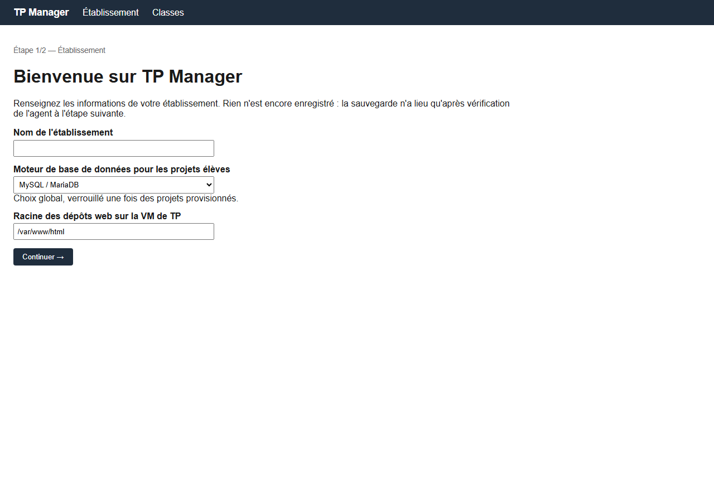

Une fois l'assistant terminé, vous arrivez sur la page de l'établissement
avec le statut de l'agent affiché ("prêt à provisionner").

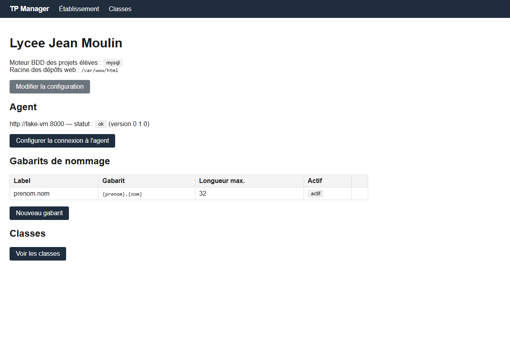

## 5. Convention de nommage des identifiants

Avant d'importer des élèves, définissez le gabarit qui génère leur login
(page **Établissement → Nouveau gabarit**). Jetons disponibles :

| Jeton | Signification |
|---|---|
| `{prenom}` | Prénom de l'élève |
| `{nom}` | Nom de l'élève |
| `{initiale_prenom}` | Première lettre du prénom |
| `{initiale_nom}` | Première lettre du nom |
| `{matricule}` | Matricule (si fourni à l'import) |
| `{annee}` | Année scolaire de la classe |

Exemple : `{prenom}.{nom}` pour "Jean Dupont" donne `jean_dupont` (le point
devient un underscore — voir [naming-patterns.md](naming-patterns.md) pour le
détail des règles de normalisation). En cas de doublon (deux "Paul Martin"
par exemple), un suffixe numérique est ajouté automatiquement
(`paul_martin`, `paul_martin2`, ...).

Un aperçu en direct (sur un échantillon fictif incluant un doublon) est
affiché sous le formulaire pour vérifier le résultat avant de valider.

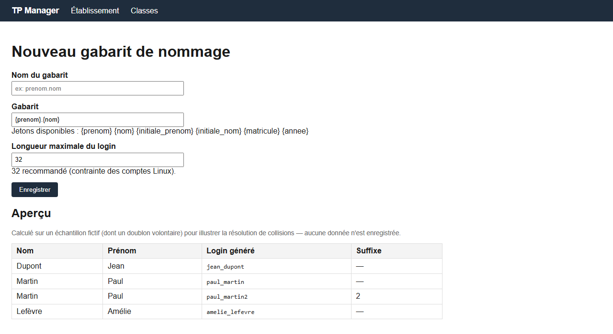

## 6. Créer une classe et importer les élèves

1. **Classes → Nouvelle classe** : nom et année scolaire.
2. Depuis la page de la classe :
   - **Ajouter un élève** pour une saisie manuelle (nom, prénom, matricule
     optionnel) ;
   - **Importer un CSV** pour un import en masse. Colonnes attendues :
     `nom`, `prenom`, `matricule` (optionnelle), délimiteur `,` ou `;`
     détecté automatiquement. Un **aperçu** des logins générés est affiché
     avant toute écriture en base — vérifiez, puis cliquez sur "Confirmer
     l'import".

   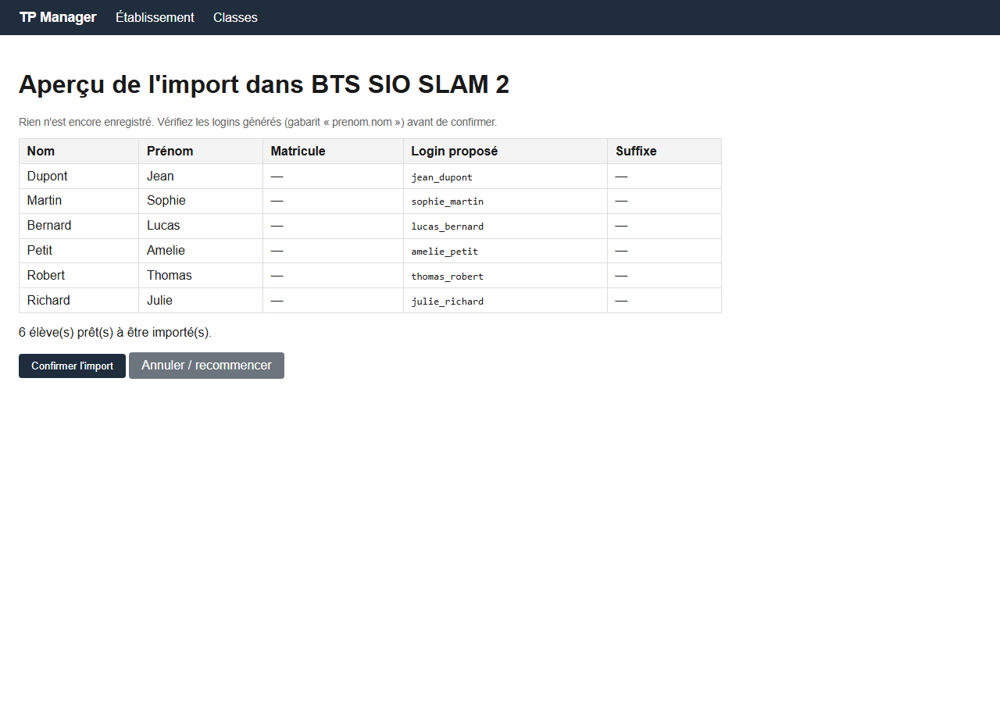

La page de la classe liste ensuite chaque élève avec son login généré, le
nombre de projets, et les actions de masse (voir section 9) :

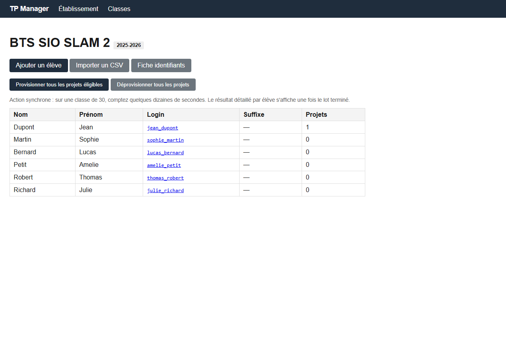

## 7. Créer et provisionner un projet

Un projet peut être créé de deux façons :

- **Élève par élève** — depuis la page d'un élève, bouton **Nouveau projet**.
  Pratique pour un projet ponctuel ou spécifique à un seul élève.
- **Pour toute la classe en une fois** — depuis la page de la classe, bouton
  **Créer un projet pour toute la classe** : indiquez un nom (ex:
  `site-vitrine`) et la méthode SSH, et ce projet est créé pour chaque élève
  de la classe qui n'en a pas déjà un du même nom (les élèves qui en ont déjà
  un ne sont pas touchés). C'est le point de départ recommandé avant
  d'utiliser le provisioning de masse (section 9) : celui-ci ne fait que
  *provisionner* des projets déjà créés, il n'en crée jamais de nouveaux.

  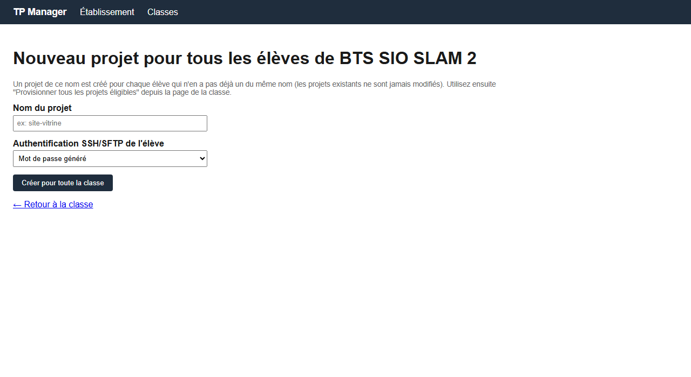

La page d'un élève liste ses projets :

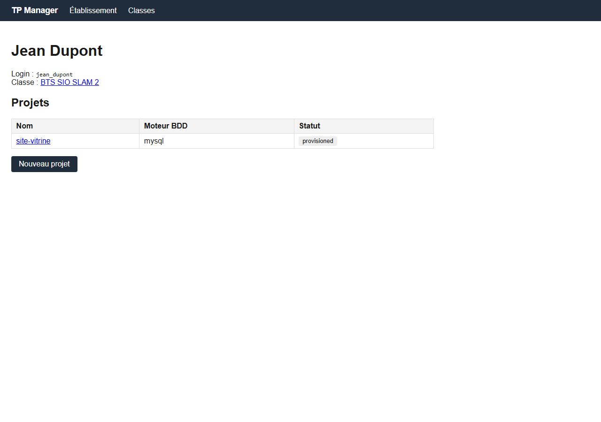

Dans les deux cas, il faut donner un nom au projet et choisir
l'authentification SSH/SFTP :

- **Mot de passe généré** — le cas le plus simple, un mot de passe aléatoire
  est créé au moment du provisioning.
- **Clé publique** — l'élève doit alors coller sa clé publique SSH au moment
  de cliquer sur "Provisionner" (elle n'est jamais enregistrée en base, seule
  son empreinte l'est, pour vérification ultérieure). Ce mode n'est pas
  compatible avec le provisioning de masse (chaque élève doit provisionner
  son propre projet individuellement, puisque sa clé doit être saisie à ce
  moment-là).

Cliquez sur **Provisionner** : l'agent crée dans l'ordre le compte Linux, la
base de données dédiée, puis le dépôt web. Le journal de provisioning (visible
sur la page du projet) trace chaque étape.

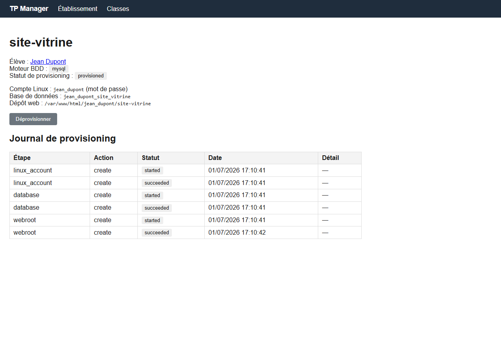

En cas de succès, vous êtes redirigé vers une page d'identifiants qui ne
s'affiche **qu'une seule fois** : notez ou transmettez les mots de passe
immédiatement, ils ne pourront plus être récupérés depuis TP Manager.

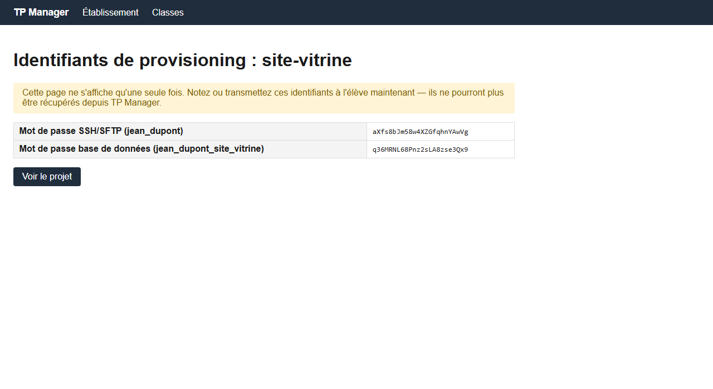

Si quelqu'un revisite ce même lien plus tard, un message clair l'indique sans
jamais réafficher le secret :

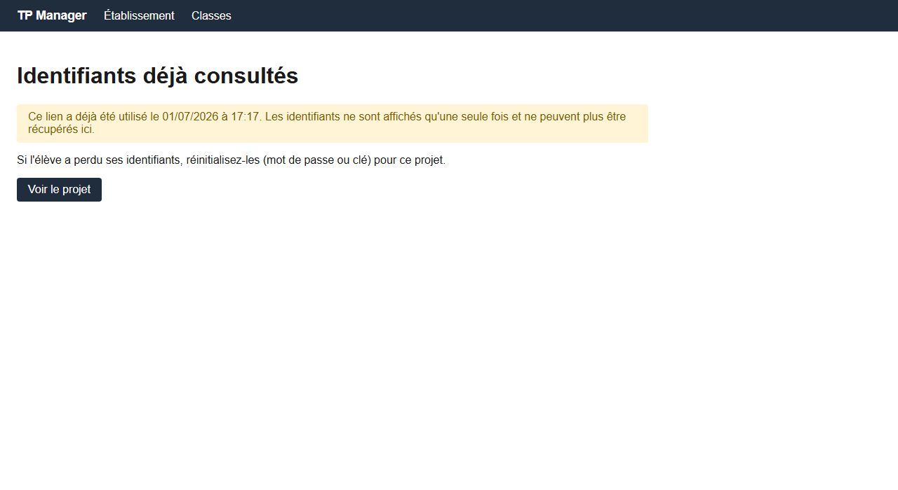

## 8. Distribuer les identifiants à la classe

La page **Fiche identifiants** d'une classe (bouton sur la page classe) liste,
pour chaque projet, le lien de récupération à usage unique s'il n'a pas encore
été consulté (ou la date de consultation sinon). C'est une page imprimable :
`Ctrl+P` puis "Enregistrer en PDF" depuis le navigateur.

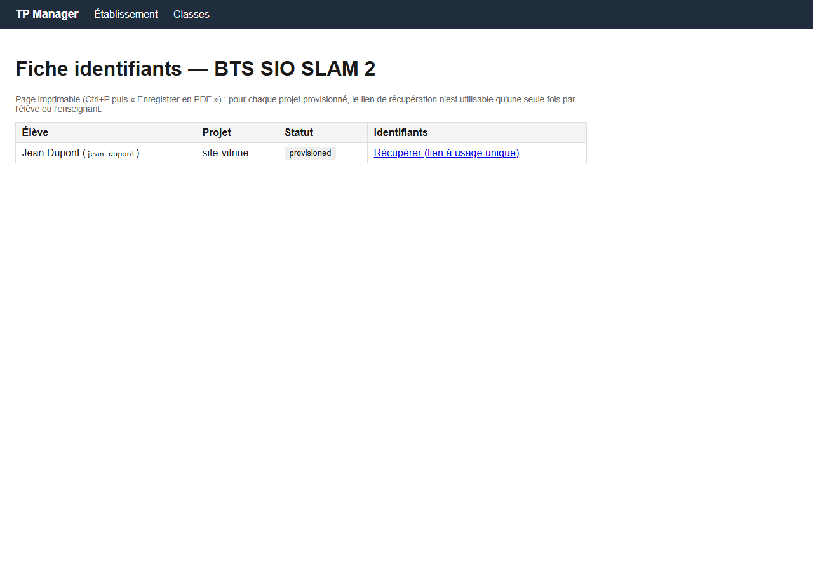

## 9. Actions de masse sur une classe

Depuis la page d'une classe :

- **Provisionner tous les projets éligibles** — provisionne en une fois tous
  les projets en attente ou en échec de la classe. Les projets configurés en
  authentification par clé publique sont automatiquement ignorés (ils
  nécessitent la clé de l'élève, saisie individuellement) et signalés comme
  tels dans le résultat.
- **Déprovisionner tous les projets** — supprime comptes, bases et dépôts web
  de tous les projets provisionnés de la classe.

L'action est synchrone : pour une classe de 30, comptez quelques dizaines de
secondes. Le résultat détaillé (réussi/échec/ignoré, avec le message d'erreur
le cas échéant) s'affiche une fois le lot terminé — un échec sur un élève
n'empêche pas les autres d'être traités.

## 10. En cas d'échec de provisioning

Sur la page d'un projet en échec :
- **Réessayer le provisioning** — sûr à cliquer autant de fois que nécessaire
  (chaque étape côté agent est idempotente : recréer un compte/une base déjà
  existante ne provoque pas d'erreur).
- **Forcer le nettoyage** (visible si le projet a déjà eu des ressources
  assignées) — rejoue la suppression des trois ressources, sans risque même
  si certaines sont déjà parties, pour repartir d'un état propre avant de
  réessayer.

## 11. Dépannage / FAQ

**"Agent injoignable" lors de la configuration ou du provisioning**
Vérifiez que le service `tpagent` tourne sur la VM (`systemctl status
tpagent` ou, en développement, les logs du conteneur `fake-vm`), que l'URL
saisie est correcte et joignable depuis le poste du dashboard (pare-feu,
port), et que le jeton n'a pas été régénéré depuis (voir
[runbooks/rotate-agent-token.md](runbooks/rotate-agent-token.md)).

**"Moteur BDD différent" pendant l'assistant**
L'établissement a été configuré pour un moteur (MySQL ou PostgreSQL) qui ne
correspond pas à celui réellement disponible sur la VM (`TPAGENT_DB_ENGINE`
de l'agent). Corrigez l'un des deux avant de continuer.

**Un élève ne peut pas se connecter en SFTP**
Vérifiez que son compte a bien été provisionné (statut "provisioned" sur la
page du projet) et que l'identifiant/mot de passe transmis correspond bien à
la dernière consultation de la fiche identifiants. Voir aussi
[security.md](security.md) pour le détail du confinement chroot (l'élève ne
peut accéder qu'à son propre dossier de projet).

**J'ai perdu le jeton de l'agent**
Le jeton n'est affiché qu'une fois par `install.sh`. Voir
[runbooks/rotate-agent-token.md](runbooks/rotate-agent-token.md) pour en
générer un nouveau sans perdre la configuration existante.
